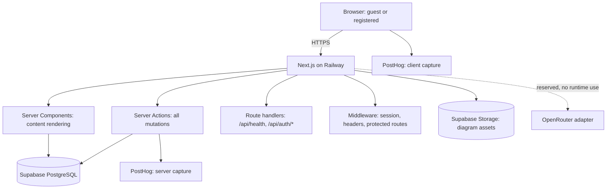

# System Architecture

One Next.js (App Router) application on Railway; Supabase-hosted PostgreSQL + Storage; BetterAuth for identity; PostHog for analytics. No microservices, queues, realtime, or edge functions in Phase 1 — one deployable, one database (ADR-017).

## Principles
- **Server-authoritative:** all mutations via Server Actions; assessment correctness never ships to the client; practice feedback does (ADR-029).
- **One write path per concept:** progress, attempts, feedback each have exactly one writing action.
- **Content is data:** all learner copy is versioned Postgres records, never JSX (ADR-020).
- **Guest-first:** every feature works without a session; guest state is device-only (ADR-025).
- **Boring by default:** complexity requires metric evidence (no queues/caches/realtime until then).
- **AI-agent legible:** strict TS, one pattern per problem, conventions in [standards.md](standards.md).

## Request lifecycle
1. Middleware: resolve BetterAuth cookie, guard `/dashboard`, set security headers.
2. Content routes render as Server Components (ISR — [performance.md](performance.md)).
3. Client islands hydrate for interactive steps.
4. Mutations: Server Action → Zod validate → resolve Actor → authorize → Drizzle transaction → server analytics → typed Result.

## Subsystem map
Web app → [frontend.md](frontend.md) · Content engine → [content-engine.md](content-engine.md) · Assessment & progress → [assessment-engine.md](assessment-engine.md) · Identity → [auth.md](auth.md) · Analytics → [analytics.md](analytics.md) · Ops → [deployment.md](deployment.md).

## Related Documents
- [../adr/README.md](../adr/README.md) — ADR-012–019 for stack composition reasoning
