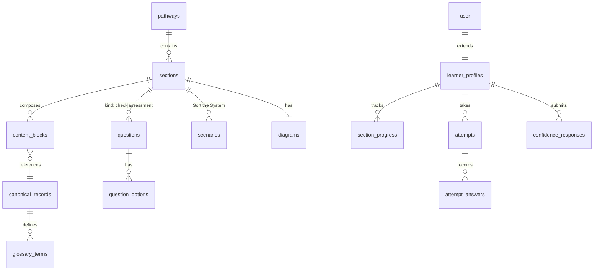

# Data Architecture

## Entity notes
- **Content** (pathways, sections, content_blocks, canonical_records, glossary_terms, diagrams): slug, layer (quick|explore|deeper|apply) on blocks, category tags, status (draft|in_review|published|archived), version, owner, review dates. Learner-facing copy lives only here.
- **Assessment** (questions, question_options, scenarios): kind, format, blueprint category, difficulty, explanation, `remediation_block_id`; options carry `is_correct` + rationale; scenarios carry correct_category, clue, ambiguity_note.
- **Learning state** (section_progress, attempts, attempt_answers, confidence_responses): progress has `steps` jsonb + `content_version`; attempts have number, question_ids[], score, passed, categories_failed[], unique `idempotency_key`, route. confidence_responses: learner_id, section_id, `stage` (pre|post), `value` (1–5), content_version - one row per submission (guest values ride the device payload until migration).
- **Identity**: BetterAuth owns user/session/account/verification; app fields go on `learner_profiles` (role enum reserved: learner | content_admin | org_admin), never on auth tables.
- **Ops**: feedback_reports, notify_requests, content_versions (immutable snapshots = content audit trail).

## Conventions
snake_case, plural tables (BetterAuth's singular `user`/`session`/`account`/`verification` are library-named and exempt), uuid v7 ids, created_at/updated_at everywhere, Postgres enums. Learner-facing content tables carry `locale` (default 'en') - a reserved shape, no runtime i18n in Phase 1 ([content-engine.md](content-engine.md)). Indexes: every FK; unique (learner_id, section_id) on progress; attempts (learner_id, section_id, number); questions (section_id, kind, category).

## Versioning & deletion
Published rows are never edited in place - publish bumps version + snapshots to content_versions; learner rows store the content_version experienced (ADR-021). Deletion is dual (ADR-022): content archives (status), learner data hard-deletes on account deletion; `deleted_at` exists nowhere.

## Migrations
Drizzle Kit, forward-only, expand→migrate→contract; backward-compatible for one release so image rollback stays safe (ADR-023). Seeds load reviewed JSON ([content-engine.md](content-engine.md)); both idempotent; applied on deploy against DIRECT_DATABASE_URL.

## Related Documents
- [content-engine.md](content-engine.md) · [deployment.md](deployment.md)
