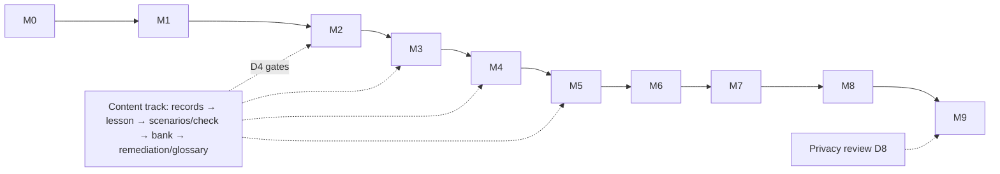

# Dependencies (D1–D8)

| D | Definition | Blocks | Owner |
|---|---|---|---|
| D1 | M0 exit: toolchain, envs, schema v0 | everything | eng lead |
| D2 | M1 exit: shell navigable | M2 | eng |
| D3 | M2 exit: **content schema freeze** (changes become migrations) | authoring at scale; M3–M4 loads | eng + content owner |
| D4 | content approvals in waves: lesson→M2, scenarios/check→M3, bank + remediation mapping→M4 (S09 links need the category→block map), remediation copy/glossary→M5 | the consuming milestone | education lead + SME |
| D5 | M5 exit: **ProgressSnapshot freeze** | M6 migration | eng |
| D6 | M6 exit: conversion live | F3 funnel (M7) | eng |
| D7 | M7 exit: surface complete | M8 audit validity | product owner |
| D8 | privacy review of guest analytics + migration payload actioned | M9 production | product owner + privacy reviewer |

**Critical path:** M0→M1→M2→M3→M4→M5→M6→M9 (M7/M8 ≈ 0.5wk slack each). D4 is the only external-pace dependency — tracked weekly. Rule: no milestone starts before its D-row is green; red → shift to parallel work (content, diagram, tests, docs, pilot recruitment from M6, presentation assembly at M8), never partial starts against unfrozen interfaces.

## Related Documents
- [risks-and-raci.md](risks-and-raci.md) — what happens when D4 slips
